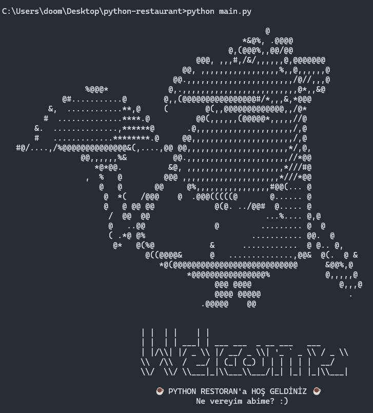
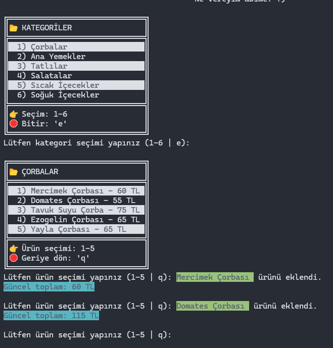
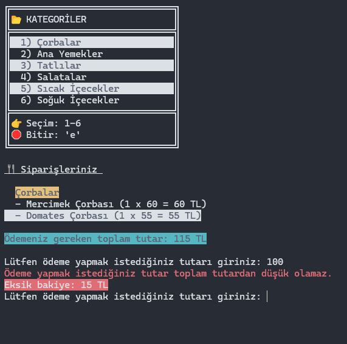
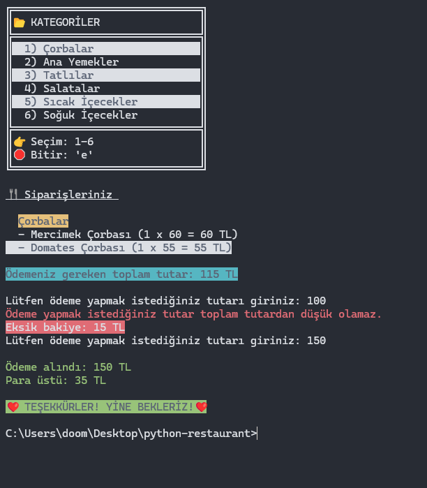

# Python Restoran

Terminal üzerinde çalışan, renkli çıktılı basit bir restoran sipariş simülasyonu. Kategorilerden ürün seçip sepete ekleyebilir, sipariş özetini görüntüleyebilir ve ödeme (para üstü dahil) adımını tamamlayabilirsiniz.

## Özellikler

- **ASCII karşılama ekranı** — `welcome.py` ile özel bir giriş görseli
- **6 kategori** — Çorbalar, ana yemekler, tatlılar, salatalar, sıcak/soğuk içecekler
- **Tuşla gezinme** — Kategori ve ürün seçimi tek tuşla (`msvcrt`)
- **Sepet** — Aynı üründen birden fazla eklenebilir; kategori bazında özet
- **Ödeme** — Toplam tutar, yetersiz ödeme uyarısı, para üstü hesabı
- **Renkli terminal çıktısı** — `colorama` ile vurgular ve hata mesajları

## Gereksinimler

- **Python 3** (önerilen: 3.8+)
- **Windows** — Tek tuş okuma için `msvcrt` kullanılır; bu modül yalnızca Windows’ta standart kütüphanede bulunur.

## Kurulum

1. Depoyu klonlayın veya projeyi bir klasöre çıkarın.

2. Bağımlılığı yükleyin:

```bash
pip install colorama
```

## Çalıştırma

Proje klasöründe:

```bash
python main.py
```

## Kullanım

| Aşama | Tuş / Giriş | Açıklama |
| ----- | ----------- | -------- |
| Kategori | `1`–`6` | İlgili menüyü açar |
| Kategori | `e` | Siparişi bitirip özet ve ödemeye geçer |
| Ürün | `1`–`5` | Seçilen ürünü sepete ekler (adet artar) |
| Ürün | `q` | Kategori listesine geri döner |
| Ödeme | Sayı | Ödenecek tutarı girin (tam sayı, TL) |

UTF-8 çıktı için `main.py` içinde konsol kodlaması ayarlanmıştır; Türkçe karakterler düzgün görünmelidir.

## Ekran görüntüleri









## Proje yapısı

```text
python restaurant/
├── main.py      # Ana döngü: kategori → ürün → özet → ödeme
├── menu.py      # MENU, CATEGORIES ve kutu çizim fonksiyonları
├── welcome.py   # Karşılama ASCII metni
├── tools.py     # Konsol temizleme (cls / clear)
├── images/      # README için ekran görüntüleri
│   ├── h1.png
│   ├── h2.png
│   ├── h3.png
│   └── h4.png
└── README.md
```

## Teknolojiler

- Python
- [colorama](https://pypi.org/project/colorama/) — Terminal renklendirme
- `msvcrt` — Windows’ta tuş bazlı giriş

---

İyi siparişler.
